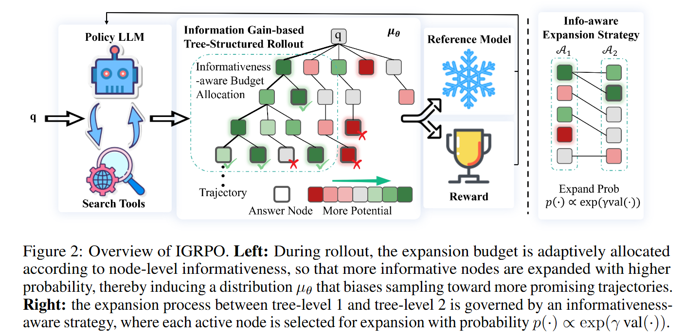
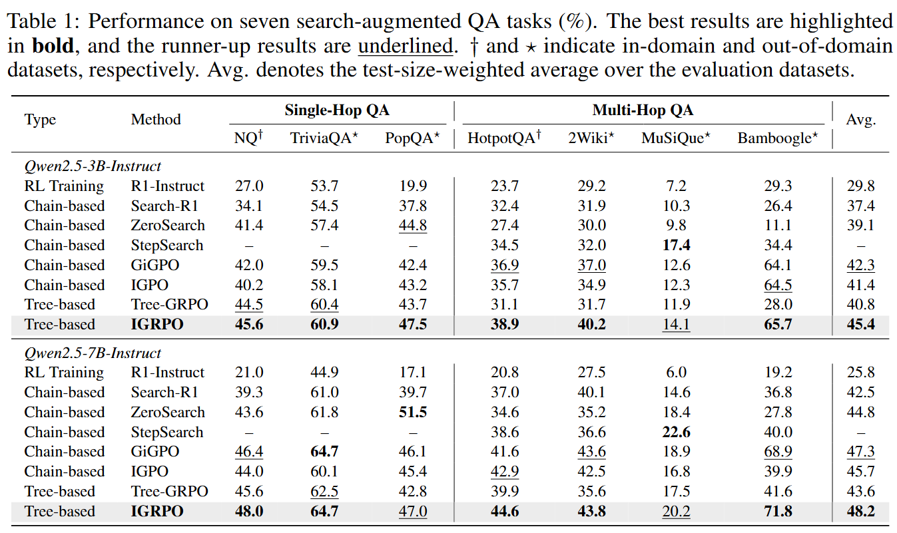

# IGRPO: Information Gain-based Rollout Policy Optimization
This repository contains the official implementation of **Information Gain-based Rollout Policy Optimization (IGRPO)**, an adaptive tree-structured rollout framework for training multi-turn search-augmented LLM agents. IGRPO allocates rollout budget according to node-level informativeness. Instead of expanding search trajectories uniformly or randomly, IGRPO prioritizes intermediate nodes that provide larger information gain toward the final answer, thereby focusing computation on more promising branches.

## ✨ Overview
<p align="center">
  
</p>

## 🌟 Highlights
- **Information gain-based tree rollout**  
  IGRPO builds a tree-structured rollout process and adaptively allocates expansion budget toward more informative intermediate states.

- **Teacher-distribution view**  
  The information gain-based rollout induces a limiting trajectory distribution that biases sampling toward more informative trajectories.

## 📌 Method
During rollout, IGRPO maintains an active set of intermediate search nodes. At each tree level, each active node is scored by an information gain-derived value. The expansion budget is then softly allocated according to this value, so that more informative nodes are expanded with higher probability while unpromising branches receive less computation. The resulting rollout process induces an informativeness-aware sampling distribution over trajectories, which is then used for GRPO-style policy optimization.

## 🧩 Main Results
<p align="center">
  
</p>

## 🚀 Installation
Our codebase is built upon [verl-agent](https://github.com/langfengQ/verl-agent). The installation process is the same as verl-agent.
### Install veRL
```bash
conda create -n igrpo python==3.12 -y
conda activate igrpo

pip3 install vllm==0.11.0 

pip3 install flash-attn==2.7.4.post1 --no-build-isolation --no-cache-dir
pip install -e .
```

### Install Search Env
```bash
conda activate igrpo
cd ./agent_system/environments/env_package/search/third_party
pip install -e .
pip install gym==0.26.2
```
Prepare dataset(default to ~/data/searchR1_processed_direct)
```bash
conda activate igrpo
python examples/data_preprocess/preprocess_search_r1_dataset.py --local_dir ~/data/searchR1_processed_direct
```
### Install Local Retriever
Since faiss-gpu is not available via pip, we setup a separate conda environment for the local retrieval server. Running this server will use around 6GB of GPU memory per GPU, so make sure to account for this in your training run configuration. Build Retriever environments:
```bash
conda create -n retriever python=3.10 -y
conda activate retriever

conda install numpy==1.26.4
pip install torch==2.6.0 torchvision==0.21.0 torchaudio==2.6.0 --index-url https://download.pytorch.org/whl/cu124

pip install transformers datasets pyserini huggingface_hub

conda install faiss-gpu==1.8.0 -c pytorch -c nvidia -y

pip install uvicorn fastapi
```
Then download the index:
```bash
conda activate retriever

local_dir=~/data/searchR1
python examples/search/searchr1_download.py --local_dir $local_dir
cat $local_dir/part_* > $local_dir/e5_Flat.index
gzip -d $local_dir/wiki-18.jsonl.gz
```

## 🚀 Training
IGRPO uses a local retrieval server during rollout generation. First activate the retriever environment and launch the retrieval server:
```bash
conda activate retriever

bash examples/search/retriever/retrieval_launch.sh > retrieval_server.log
```
After the retriever server is ready, activate the IGRPO training environment and run the training script:
```bash
conda activate igrpo
bash examples/igrpo_trainer/run_search.sh
```